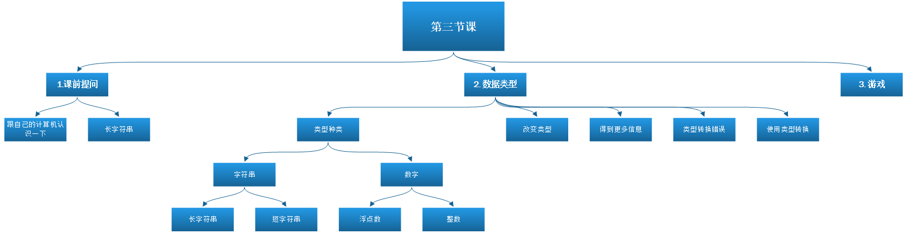

# class 4



## **1. 课前提问**


1. Python 中乘法使用哪个符号？

2. Python 计算 8 / 3 的答案是什么？

3. 怎么得到 8 / 3 的余数？

4. 怎么得到 8 / 3 的小数结果？

5. Python 中计算 6 * 6 * 6 * 6 的另一种做法是什么？

6. 采用 E 记法，17 000 000 要写作什么？


```python
6**4
```


    1296


```python
6*6*6*6
```


    1296


```python
1.7e+7
```


    17000000.0


```python
6*6*6*6
```


    1296


### 1.2 跟python认识一下


```python
name = input("What is your name?\n")
print("Hi, ", name * 300)
```

    Hi,  markmarkmarkmarkmarkmarkmarkmarkmarkmarkmarkmarkmarkmarkmarkmarkmarkmarkmarkmarkmarkmarkmarkmarkmarkmarkmarkmarkmarkmarkmarkmarkmarkmarkmarkmarkmarkmarkmarkmarkmarkmarkmarkmarkmarkmarkmarkmarkmarkmarkmarkmarkmarkmarkmarkmarkmarkmarkmarkmarkmarkmarkmarkmarkmarkmarkmarkmarkmarkmarkmarkmarkmarkmarkmarkmarkmarkmarkmarkmarkmarkmarkmarkmarkmarkmarkmarkmarkmarkmarkmarkmarkmarkmarkmarkmarkmarkmarkmarkmarkmarkmarkmarkmarkmarkmarkmarkmarkmarkmarkmarkmarkmarkmarkmarkmarkmarkmarkmarkmarkmarkmarkmarkmarkmarkmarkmarkmarkmarkmarkmarkmarkmarkmarkmarkmarkmarkmarkmarkmarkmarkmarkmarkmarkmarkmarkmarkmarkmarkmarkmarkmarkmarkmarkmarkmarkmarkmarkmarkmarkmarkmarkmarkmarkmarkmarkmarkmarkmarkmarkmarkmarkmarkmarkmarkmarkmarkmarkmarkmarkmarkmarkmarkmarkmarkmarkmarkmarkmarkmarkmarkmarkmarkmarkmarkmarkmarkmarkmarkmarkmarkmarkmarkmarkmarkmarkmarkmarkmarkmarkmarkmarkmarkmarkmarkmarkmarkmarkmarkmarkmarkmarkmarkmarkmarkmarkmarkmarkmarkmarkmarkmarkmarkmarkmarkmarkmarkmarkmarkmarkmarkmarkmarkmarkmarkmarkmarkmarkmarkmarkmarkmarkmarkmarkmarkmarkmarkmarkmarkmarkmarkmarkmarkmarkmarkmarkmarkmarkmarkmarkmarkmarkmarkmarkmarkmarkmarkmarkmarkmarkmarkmarkmarkmarkmarkmarkmarkmarkmarkmarkmarkmarkmarkmarkmarkmarkmarkmarkmarkmark
    

### 1.3长字符串
如果希望得到一个跨多行的字符串，必须使用一种特殊的字符串，称为三重引号字符串（triple-quoted string）


```python
name='sandy'
```


```python
long_string = '''
碧玉装成一树高，
万条垂下绿丝绦。
不知细叶谁裁出，
二月春风似剪刀。
'''
print(long_string)
```

    
    碧玉装成一树高，
    万条垂下绿丝绦。
    不知细叶谁裁出，
    二月春风似剪刀。
    
    


```python

```

## **2.数据的类型（第四章）**


### 2.1 改变类型


```python
kimi_room='13301'
print(float(kimi_room))
```

    13301.0
    


```python
kimi_room='13301'
print(int(kimi_room))
```

    13301
    


```python
mark_room=15501
mark_room=str(mark_room)
gouwo=mark_room+'1'
print(gouwo)
# print(str(mark_room))
```

    155011
    


### 将整数转换为浮点数


```python
edison_score = 100
edison_score_f = float(edison_score)
print('edison_score=',edison_score,'edison_score_f=',edison_score_f)
```

    edison_score= 100 edison_score_f= 100.0
    

### 将浮点数转换为整数


```python
e=54.99
f=int(e)
print(e,f)
```

    54.99 54
    

### 将字符串转换为浮点数


```python
a = '76.3'
b = float(a)
# print(a,b)
type(a)

```

    76.3 76.3
    


### 2.2 得到更多信息：type()


```python
a = '44.2'
b = 44.2
print(type(b))
```

    <class 'float'>
    

### 2.3 类型转换错误


```python
alice = '100'
print (float(alice))
```

    100.0
    

### 2.4 使用类型转换

[华氏度和摄氏度，傻傻分不清！](https://haokan.baidu.com/v?vid=4040083079795578942)


* 公式

摄氏度 = 5/9*（华氏度-32）
摄氏度 = （华氏度-32）/1.8

cel = 5.0 / 9 * (fahr - 32)


```python
fahr = 43
cel = (fahr-32)/1.8
print('华氏度=',fahr,'转换成摄氏度=',cel)
```

    华氏度= 43 转换成摄氏度= 6.111111111111111
    


```python
#在我们的温度转换程序中，可以这样做吗？
cel = float(5 / 9 * (fahr - 32))
cel = 5 / 9 * float(fahr - 32)
print('华氏度=',fahr,'转换成摄氏度=',cel)
```

    华氏度= 43 转换成摄氏度= 6.111111111111112
    

### 测试题


```python
e=53.9
d=int(e)
print(d)
```

    53
    


```python
a = 13.2
roundoff = int(a + 0.5)
print(a,roundoff)
b = 13.7
roundoff = int(b + 0.5)
print(b,roundoff)
```

    13.2 13
    13.7 14
    

动手试一试

1. 使用 float() 从一个字符串（如 '12.34'）创建一个数。要保证结果确实是一个数！


```python
a = float('12.34')
print (a)
```

    12.34
    

2. 试着使用 int() 从一个小数（56.78）创建一个整数。答案是上取整还是下取整？


```python
 print(int(56.78))

```

    56
    

3. 试着使用 int() 从一个字符串创建整数。要保证结果确实是一个整数！


```python
a = int('75')
print (a)
```

    75
    

## **3.游戏**
星际大战5
