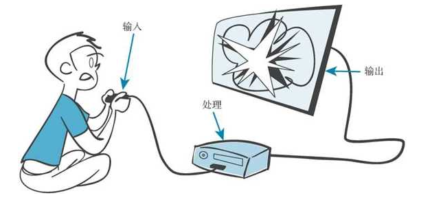

# class 5
# 1.课前提问

* python中基本数据类型有几种？分别是？
* str()、int() 和 float()的作用分别是什么？
* type() 函数的作用是什么？
* 使用 int() 将小数转换为整数，结果是上取整还是下取整？
* 除了 int() 不使用任何其他函数，如何对一个数四舍五入而不是下取整？（例如，13.2 会下取整为 13，但是 13.7 会上取整为 14。）

# 2.第五章内容——输入

## 2.1 input()



```python
some_name=input()
print(some_name)
```

    mark
    


```python
print ("Enter your name: ")
somebody = input()
print ("Hi", somebody, "how are you today?")
```

    Enter your name: 
    Hi richie how are you today?
    

## 2.2 print 命令和逗号


```python
somebody = input("Enter your name: ")
print ("Hi,", somebody, "how are you today?")
```

    Hi, sss how are you today?
    

## 2.3 输入数字


```python
a = 13.2
roundoff = int(a + 0.5)
print('a=',a,'b=',roundoff)
```

    a= 13.2 b= 13
    


```python
a=input()
roundoff = int(a + 0.5)
print('a=',a,'b=',roundoff)
```


    ---------------------------------------------------------------------------
    

    TypeError                                 Traceback (most recent call last)
    

    d:\Project\svn_test\BaiduNetdiskWorkspace\MM\CLASS\class5.ipynb Cell 7 in <cell line: 2>()
    

          <a href='vscode-notebook-cell:/d%3A/Project/svn_test/BaiduNetdiskWorkspace/MM/CLASS/class5.ipynb#ch0000016?line=0'>1</a> a=input()
    

    ----> <a href='vscode-notebook-cell:/d%3A/Project/svn_test/BaiduNetdiskWorkspace/MM/CLASS/class5.ipynb#ch0000016?line=1'>2</a> roundoff = int(a + 0.5)
    

          <a href='vscode-notebook-cell:/d%3A/Project/svn_test/BaiduNetdiskWorkspace/MM/CLASS/class5.ipynb#ch0000016?line=2'>3</a> print('a=',a,'b=',roundoff)
    

    
    

    TypeError: can only concatenate str (not "float") to str


## 2.4 来自互联网的输入


```python
import pandas as pd
dfs = pd.read_html('https://funddb.cn/site/index')
dfs[1]
```


<div>
<style scoped>
    .dataframe tbody tr th:only-of-type {
        vertical-align: middle;
    }

    .dataframe tbody tr th {
        vertical-align: top;
    }

    .dataframe thead th {
        text-align: right;
    }
</style>
<table border="1" class="dataframe">
  <thead>
    <tr style="text-align: right;">
      <th></th>
      <th>0</th>
      <th>1</th>
      <th>2</th>
      <th>3</th>
      <th>4</th>
      <th>5</th>
      <th>6</th>
      <th>7</th>
      <th>8</th>
    </tr>
  </thead>
  <tbody>
    <tr>
      <th>0</th>
      <td>全指通信000994.CSI</td>
      <td>18.26</td>
      <td>0.04%</td>
      <td>1.42</td>
      <td>0.29%</td>
      <td>1.61</td>
      <td>99.30%</td>
      <td>-21.42%</td>
      <td>查看详情</td>
    </tr>
    <tr>
      <th>1</th>
      <td>德国DAXGDAXI.GI</td>
      <td>11.42</td>
      <td>0.08%</td>
      <td>1.43</td>
      <td>6.53%</td>
      <td>3.61</td>
      <td>96.05%</td>
      <td>-19.34%</td>
      <td>查看详情</td>
    </tr>
    <tr>
      <th>2</th>
      <td>澳洲标普200AS51.GI</td>
      <td>15.00</td>
      <td>0.68%</td>
      <td>1.98</td>
      <td>36.44%</td>
      <td>5.06</td>
      <td>92.99%</td>
      <td>-11.11%</td>
      <td>查看详情</td>
    </tr>
    <tr>
      <th>3</th>
      <td>380价值000118.SH</td>
      <td>8.34</td>
      <td>0.75%</td>
      <td>1.00</td>
      <td>1.99%</td>
      <td>4.10</td>
      <td>99.42%</td>
      <td>1.05%</td>
      <td>查看详情</td>
    </tr>
    <tr>
      <th>4</th>
      <td>医疗器械h30217.CSI</td>
      <td>21.61</td>
      <td>0.87%</td>
      <td>5.45</td>
      <td>29.38%</td>
      <td>1.15</td>
      <td>98.99%</td>
      <td>-14.73%</td>
      <td>查看详情</td>
    </tr>
    <tr>
      <th>...</th>
      <td>...</td>
      <td>...</td>
      <td>...</td>
      <td>...</td>
      <td>...</td>
      <td>...</td>
      <td>...</td>
      <td>...</td>
      <td>...</td>
    </tr>
    <tr>
      <th>153</th>
      <td>中证全指电力指数h30199.CSI</td>
      <td>66.88</td>
      <td>98.93%</td>
      <td>1.93</td>
      <td>87.36%</td>
      <td>1.99</td>
      <td>4.72%</td>
      <td>-9.23%</td>
      <td>查看详情</td>
    </tr>
    <tr>
      <th>154</th>
      <td>汽车(申万)801880.SI</td>
      <td>35.53</td>
      <td>99.5%</td>
      <td>2.47</td>
      <td>72.96%</td>
      <td>1.38</td>
      <td>30.48%</td>
      <td>-4.30%</td>
      <td>查看详情</td>
    </tr>
    <tr>
      <th>155</th>
      <td>全指消费000990.CSI</td>
      <td>75.53</td>
      <td>99.92%</td>
      <td>6.92</td>
      <td>88.04%</td>
      <td>1.24</td>
      <td>33.69%</td>
      <td>-4.93%</td>
      <td>查看详情</td>
    </tr>
    <tr>
      <th>156</th>
      <td>全指公用000995.CSI</td>
      <td>49.33</td>
      <td>100%</td>
      <td>1.94</td>
      <td>87.35%</td>
      <td>2.06</td>
      <td>16.18%</td>
      <td>-9.29%</td>
      <td>查看详情</td>
    </tr>
    <tr>
      <th>157</th>
      <td>农林牧渔(申万)801010.SI</td>
      <td>131.47</td>
      <td>100%</td>
      <td>3.74</td>
      <td>67.84%</td>
      <td>0.44</td>
      <td>11.30%</td>
      <td>2.26%</td>
      <td>查看详情</td>
    </tr>
  </tbody>
</table>
<p>158 rows × 9 columns</p>
</div>


## 2.5 你学到了什么

## 2.6 测试题
1. 如果用户键入 12，answer 的数据类型是什么？是字符串还是一个数？

2. 怎么让 raw_input() 打印一个提示消息？

3. 怎么使用 raw_input() 得到一个整数？

4. 怎么使用 raw_input() 得到一个浮点数（小数）？

## 2.7 动手试一试
1. 在交互模式中建立两个变量，分别表示你的姓和名。然后使用一条 print 语句，把姓和名打印在一起。

2. 编写一个程序，先问你的姓，再问名，然后打印一条消息，在消息中包含你的姓和名。

3. 编写一个程序询问一间长方形房间的尺寸（单位是米），然后计算覆盖整个房间总共需要多少地毯，并显示出来。

4. 课后作业：编写一个程序先完成第 3 题的要求，不过还要询问每平方尺地毯的价格。然后主程序显示下面 3 个内容：

总共需要多少地毯，单位是平方米。

总共需要多少地毯，单位是平方尺（1 平方米 = 9 平方尺）。

地毯总价格。

5. 课后作业：编写一个程序帮助用户统计她的零钱。程序要问下面的问题。

“有多少个五分币？”

“有多少个二分币？”

“有多少个一分币？”

让程序给出这些零钱的总面值


```python
# no 1
last_name='liu'
first_name = 'ruichao'
print(last_name+' '+first_name)
```

    liu ruichao
    


```python
# no 2
last_name=input('please input your family name:')
first_name = input('please input your first name:')
print(last_name+first_name)
```

    liu ruichao
    


```python
# no 3
length = float(input ('length of the gouwo in feet: '))
width = float(input ('width of the gouwo in feet: '))
area = length * width
print ('The area of gouwo is', area, 'square feet.')
```

    The area is 12.0 square feet.
    

# 3.游戏环节
